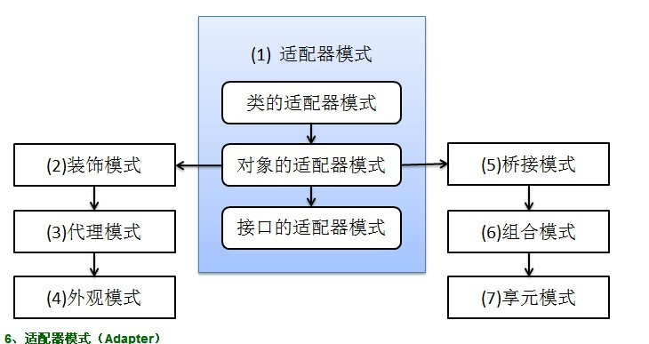
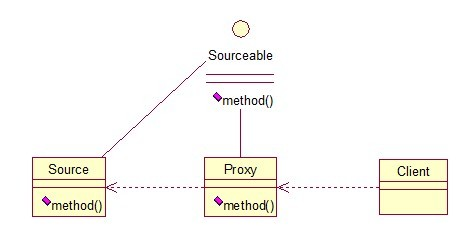

# 设计模式

## 设计模式的分类

总的来说，设计模式分为三大类

创建型模式，共五种：工厂方法模式、抽象工厂模式、单例模式、建造者模式、原型模式。

结构型模式，共七种：适配器模式、装饰器模式、代理模式、外观模式、桥接模式、组合模式、享元模式。

行为型模式，共十一种：策略模式、模板方法模式、观察者模式、迭代子模式、责任链模式、命令模式、备忘录模式、状态模式、访问者模式、中介者模式、解释器模式。

其实还有两类：并发型模式和线程池模式。用一个图片来整体描述一下：


## 设计模式的六大原则

* 总原则：开闭原则（Open Close Principle）

开闭原则就是说对扩展开放，对修改关闭。在程序需要进行扩展的时候，不能去修改原有的代码，而是要扩展原有的代码，实现一个热插拔的效果。所以一句话概括就是：为了使程序的扩展性好，易于维护和升级。想要达到这样的效果，我们需要使用接口和抽象类等。

1. **单一职责原则**

不要存在多于一个导致类变更的原因。也就是说，每个类应该实现单一的职责，如若不然，就应该把类拆分。


2. **里氏替换原则（Liskov Substitution Principle）**

里氏替换原则是面向对象设计的基本原则之一。里氏替换原则中说，任何基类可以出现的地方，子类一定可以出现。LSP是继承复用的基石，只有当衍生类可以替换掉基类，软件单位的功能不受到影响时，基类才能真正被复用，而衍生类也能够在基类的基础上增加新的行为。里氏替换原则是对“开-闭”原则的补充。实现“开-闭”原则的关键步骤就是抽象化。而基类与子类的继承关系就是抽象化的具体实现。所以里氏替换原则是对实现抽象化的具体步骤的规范。

里氏替换原则中，子类对父类的方法尽量不要重写和重载。因为父类代表了定义好的结构，通过这个规范的接口与外界交互，子类不应该随便破坏它。


3. **依赖倒转原则（Dependence Inversion Principle）**

这个是开闭原则的基础，具体内容：面向接口编程，依赖于抽象而不依赖于具体。写代码时用到具体类时，不与具体类交互，而与具体类的上层接口交互。


4. **接口隔离原则（Interface Segregation Principle）**

这个原则的意思是：每个接口中不存在子类用不到却必须实现的方法，如果不然，就要将接口拆分。使用多个隔离的接口，比使用单个接口（多个接口方法集合到一个的接口）要好。


5. **迪米特法则（最少知道原则）（Demeter Principle）**

就是说：一个类对自己依赖的类知道的越少越好。也就是说，无论被依赖的类多么复杂，都应该将逻辑封装在方法的内部，通过public方法提供给外部。这样当被依赖的类变化时，才能最小的影响该类。


6. **合成复用原则（Composite Reuse Principle）**

原则是尽量首先使用合成/聚合的方式，而不是使用继承。


## 创建模式

0. 简单工厂模式

简单工厂模式分为三种：

* 普通

就是建立一个工厂类，对实现了同一接口的一些类进行实例的创建。


代码如下：

``` java
//共同接口
interface Sender {
	public void Send();
}

//实现类
class MailSender implements Sender {
	@Override
	public void Send() {
		System.out.println("this is mail sender");
	}
}

class SmsSender implements Sender {
	@Override
	public void Send() {
		System.out.println("this is sms sender");
	}
}

//工厂类
public class SimpleFatory {
	public Sender produce(String type) {
		if ("mail".equals(type)) {
			return new MailSender();
		} else if ("sms".equals(type)) {
			return new SmsSender();
		} else {
			System.out.println("请输入正确的类型");
			return null;
		}
	}
}
```

测试类如下：

``` java
public class DesignMode {
	public static void main(String []args) {
		SimpleFatory factory = new SimpleFatory();
		Sender sender = factory.produce("mail");
		sender.Send();
	}
}

```


* 多个方法

是对普通工厂方法模式的改进，在普通工厂方法模式中，如果传递的字符串出错，则不能正确创建对象。而多个工厂方法模式是提供多个工厂方法，分别创建对象。


将上面的代码做下修改，改动下SimpleFactory类就可以，如下：

``` java
//工厂类
public class SimpleFatory {
	public Sender produceMail() {
		return new MailSender();
	}
	
	public Sender produceSms() {
		return new SmsSender();
	}
}
```

测试类如下：

``` java
public class DesignMode {
	public static void main(String []args) {
		SimpleFatory factory = new SimpleFatory();
		Sender sender = factory.produceMail();
		sender.Send();
	}
}
```


* 多个静态方法

将上面的多个工厂方法模式里的方法置为静态，不需要创建实例，直接调用即可

``` java
//工厂类
public class SimpleFatory {
	public static Sender produceMail() {
		return new MailSender();
	}
	
	public static Sender produceSms() {
		return new SmsSender();
	}
}
```

测试代码

``` java
public class DesignMode {
	public static void main(String []args) {
		Sender sender = SimpleFatory.produceMail();
		sender.Send();
	}
}
```


总体来说，工厂模式适合：凡是出现了大量的产品需要创建，并且具有共同的接口时，可以通过工厂方法模式进行创建。在以上的三种模式中，第一种如果传入的字符串有误，则不能正确创建对象，第三种相对于第二种，不需要实例化工厂类。所以，在大多数情况下，我们都会选用第三种——静态工厂方法模式。


1. 工厂方法模式（Factory Method）

简单工厂模式有一个问题就是，类的创建依赖工厂类。也就是说，如果想要拓展程序，必须对工厂类进行修改，这违背了闭包原则，所以，从设计角度考虑，有一定的问题。而工厂方法模式，通过创建一个工厂接口和创建多个工厂实现类，这样一旦需要增加新的功能，直接增加新的工厂类就可以了，不需要修改之前的代码。


``` gjava
//共同接口
interface Sender {
	public void Send();
}

//实现类
class MailSender implements Sender {
	@Override
	public void Send() {
		System.out.println("this is mail sender");
	}
}

class SmsSender implements Sender {
	@Override
	public void Send() {
		System.out.println("this is sms sender");
	}
}
```


``` java
//工厂类
interface Provider {
	public Sender Produce();
}

class SendMailFactory implements Provider{
	@Override
	public Sender Produce() {
		return new MailSender();
	}
}

class SendSmsFactory implements Provider {
	@Override
	public Sender Produce() {
		return new SmsSender();
	}
}
```


``` java
//测试代码
public class DesignMode {
	public static void main(String []args) {
		Provider provider = new SendMailFactory();
		Sender sender = provider.Produce();
		sender.Send();
	}
}
```

这个模式的好处就是，如果需要增加一个新的功能，则只需要做一个实现类，实现Sender接口，同时做一个工厂类，实现Provider接口就可以了，无需去改动原有代码。


2. 抽象工厂模式

工厂方法模式和抽象工厂模式不好分清楚，他们的区别如下：

工厂方法模式：

一个抽象产品类，可以派生出多个具体产品类。

一个抽象工厂类，可以派生出多个具体工厂类。

每个具体工厂类只能创建一个具体产品类的实例。


抽象工厂模式：

多个抽象产品类，每个抽象产品类可以派生出多个具体产品类。

一个抽象工厂类，可以派生出多个具体工厂类。

每个具体工厂类可以创建多个具体产品类的实例，也就是创建的是一个产品线下的多个产品。


区别：

工厂方法模式只有一个抽象产品类，而抽象工厂模式有多个。

工厂方法模式的具体工厂类只能创建一个具体产品类的实例，而抽象工厂模式可以创建多个。


3. 单例模式（Simgleton）

单例模式是一种常用的设计模式，在java应用中，单例模式能保证在一个JVM中，该对象只有一个实例存在。这样的模式有几个好处：

1） 某些类创建比较频繁，对于一些大型的对象，这是一笔很大的系统开销。

2） 省去了new操作符，降低了系统内存的使用频率，减轻GC压力。

3） 有些类如交易所的核心交易引擎，控制着交易流程，如果该类可以创建多个的话，系统完全乱了。所以只有使用单例模式，才能保证核心交易服务器独立控制整个流程。

``` java
//一个简单的单例类
public class Singleton {	
	/* 持有私有静态实例，防止被引用，此处赋值为null，目的是实现延迟加载 */
	private static Singleton instance = null;

	/* 私有构造方法，防止被实例化 */
	private Singleton() {
	};

	/* 静态工程方法，创建实例 */
	public static Singleton getInstance() {
		if (instance == null) {
			instance = new Singleton();
		}
		return instance;
	}

	/* 如果该对象被用于序列化，可以保证对象在序列化前后保持一致 */
	public Object readResolve() {
		return instance;
	}
}
```

单例模式使用内部类来维护单例的实现，JVM内部的机制能够保证当一个类被加载的时候，这个类的加载过程是线程互斥的。这样当我们第一次调用getInstance的时候，JVM能够帮我们保证instance只被创建一次，并且会保证把赋值给instance的内存初始化完毕，这样我们就不用担心多线程竞争的问题。同时该方法也只会在第一次调用的时候使用互斥机制，这样就解决了低性能问题。

``` java
public class Singleton {	
	/* 私有构造方法，防止被实例化 */
	private Singleton() {
	};

	/* 此处使用一个内部类来维护单例 */
	private static class SingletonFactory {
		private static Singleton instance = new Singleton();
	}
	
	/* 获取实例 */
	public static Singleton getInstance() {
		return SingletonFactory.instance;
	}

	/* 如果该对象被用于序列化，可以保证对象在序列化前后保持一致 */
	public Object readResolve() {
		return getInstance();
	}
}
```

因为单例模式只需要在创建类的时候进行同步，所以只要将创建和getInstance（）分开，单独为创建加synchronized关键字，也是可以的。

``` java
public class Singleton {
	private static Singleton instance = null;

	/* 私有构造方法，防止被实例化 */
	private Singleton() {
	};

	private static synchronized void syncInit() {
		if (instance == null) {
			instance = new Singleton();
		}
	}

	public static Singleton getInstance() {
		if (instance == null) {
			syncInit();
		}
		return instance;
	}
}
```


4. 建造者模式（Builder）

建造者模式是将一个复杂的对象的构建与它的表示分离，使得同样的构建过程可以创建不同的表示。建造者模式隐藏了复杂对象的创建过程，它把复杂对象的创建过程加以抽象，通过子类继承或者重载的方式，动态的创建具有复合属性的对象。

* 指挥者（Director）直接和客户（Client）进行需求沟通
* 沟通后指挥者将客户创建产品的需求划分为各个部件的建造请求（Builder）
* 将各个部件的建造请求委派到具体的建造者（ConcreteBuilder）
* 各个具体建造者负责进行产品部件的构建
* 最终构建成具体产品

``` java
//产品类
class Computer {
	private String band;
	private String screen;
	private String host;

	public void getBand() {
		System.out.println(band);
	}

	public void setBand(String band) {
		this.band = band;
	}

	public void getScreen() {
		System.out.println(screen);
	}

	public void setScreen(String screen) {
		this.screen = screen;
	}

	public void getHost() {
		System.out.println(host);
	}

	public void setHost(String host) {
		this.host = host;
	}
}

//建造类
public abstract class Builder {
	abstract void buildBand();

	abstract void buildScreen();

	abstract void buildHost();

	abstract Computer buildComputer();
}

//具体建造类
class DellComputer extends Builder {
	private Computer computer = new Computer();

	@Override
	void buildBand() {
		computer.setBand("Dell Band");
	}

	@Override
	void buildScreen() {
		computer.setScreen("Dell Screen");
	}

	@Override
	void buildHost() {
		computer.setHost("Dell Host");
	}

	@Override
	Computer buildComputer() {
		return computer;
	}
}

class AcerComputer extends Builder {
	Computer computer = new Computer();

	@Override
	void buildBand() {
		computer.setBand("Acer Band");
	}

	@Override
	void buildScreen() {
		computer.setScreen("Acer Screen");
	}

	@Override
	void buildHost() {
		computer.setHost("Acer Host");
	}

	@Override
	Computer buildComputer() {
		return computer;
	}
}

//指挥者
class Director {
	private Builder builder = null;

	public Director(Builder builder) {
		this.builder = builder;
	}

	public Computer construct() {
		builder.buildBand();
		builder.buildScreen();
		builder.buildHost();
		return builder.buildComputer();
	}
}
```


测试代码：

``` java
public class DesignMode {
	public static void main(String []args) {
		showComputer(new DellComputer());	
		showComputer(new AcerComputer());
	}
	
	private static void showComputer(Builder builder) {
		Director director = new Director(builder);
		Computer computer = director.construct();
		computer.getBand();
		computer.getScreen();
		computer.getHost();
	}
}
```


5. 原型模式（ProtoType）

原型模式虽然是创建型的模式，但是与工程模式没有关系。该模式的思想就是讲一个对象作为原型，对其进行复制、克隆，产生一个和原对象类似的新对象。在Java中，复制对象是通过Clone（）实现的。

``` java
public class ProtoType implements Cloneable {
	private String name;
	private String birth;
	private String gender;
	private String school;
	private String timeArea;
	private String company;

	/* 构造函数 */
	public ProtoType(String name) {
		this.name = name;
	}

	/* 设定个人基本信息 */
	public void setPersonInfo(String birth, String gender, String school) {
		this.birth = birth;
		this.gender = gender;
		this.school = school;
	}

	/* 设定工作经历 */
	public void setWorkExperience(String timeArea, String company) {
		this.timeArea = timeArea;
		this.company = company;
	}

	/* 重载克隆函数 */
	public Object clone() {
		ProtoType proto = null;
		try {
			proto = (ProtoType) super.clone();
		} catch (CloneNotSupportedException e) {
			e.printStackTrace();
		}

		return proto;
	}

	public void display() {
		System.out.println("姓名：" + name);
		System.out.println("生日：" + birth + ", 性别：" + gender + "， 毕业学校：" + school);
		System.out.println("工作年限：" + timeArea + ", 公司：" + company);
	}
}
```

测试代码：

``` java
public class DesignMode {
	public static void main(String []args) {
		ProtoType a = new ProtoType("Tom");
		a.setPersonInfo("2.16", "male", "Oxford");
		a.setWorkExperience("3 years", "MicroSoft");
		
		//克隆b对象
		ProtoType b = (ProtoType)a.clone();
		
		//输出a对象
		System.out.print("a is:");
		a.display();
		
		//输出b对象
		System.out.print("b is:");
		b.display();
		
		//测试a和b是否相等
		//对任何对象，都有a.clone() != a，即克隆对象和原对象不是同一个对象
		System.out.println("a == b?");
		System.out.println(a == b);
		
		//对任何对象，都有a.clone().getClass() = a.getClass()，即克隆对象和原对象的类型一样
		System.out.println("a.getClass() == b.getClass()?");
		System.out.println(a.getClass() == b.getClass());
	}
}
```


## 结构模式




6. 适配器模式

适配器模式将某个类的接口转换成客户端期望的另一个接口表示，目的是消除由于接口不匹配所造成的类的兼容问题。主要分为三类：类的适配器模式、对象的适配器模式、接口的适配器模式。

* 类的适配器模式


核心思想就是：有一个Source类，拥有一个方法，待适配，目标接口是Targetable，通过Adapter类，将Source的功能扩展到Targetable里。

代码如下
``` java
//source类
public class Source {
    public void method1(){
        System.out.println("this is original method");
    }
}


//targetable接口
public interface Targetable {
    public void method1();
    public void method2();
}

//adapter类
public class Adapter extends Source implements Targetable {
    @Override
    public void method2(){
        System.out.println("this is the targetale method");
    }
}

//测试代码
public class DesignMode {
	public static void main(String []args) {
		Targetable target = new Adapter();
		target.method1();
		target.method2();
	}
}
```
输出结果：

this is original method

this is the targetale method

* 对象的适配器模式

基本思路和类的适配器模式相同，只是将Adapter类作修改，这次不继承Source类，而是持有Source类的实例，以达到解决兼容性的问题。


只需要修改Adapter类的源码即可
```java
public class Wrapper implements Targetable {
    private Source source;

    public Wrapper(Source source){
        super();
        this.source = source;
    }

    @Override
    public void method1() {
        source.method1();
    }

    @Override
    public void method2() {
        System.out.println("this is targetable method");
    }
}

//测试代码
public static void main(String []args) {
		Source source = new Source();
		Wrapper wrapper = new Wrapper(source);
		wrapper.method1();
		wrapper.method2();
	}
```

* 接口的适配器模式

第三种适配器模式是接口的适配器模式。接口的适配器模式是这样的：有时我们写的一个接口中有多个抽象方法，当我们写改接口的实现类时，必须实现该接口的所有方法，这明显有时比较浪费，因为并不是所有的方法都是我们需要的，有时只需要某一些。因此，为了解决这个问题，我们借助于一个抽象类，该抽象类实现了该接口，实现了所有的方法，而我们不和原始的接口打交道，只和该抽象类取得联系，所以我们写一个类，继承该抽象类，重写我们需要的方法就行。


代码如下：
```java
//接口
public interface Sourceable {
    public void method1();
    public void method2();
}

//抽象类
public abstract class Wrapper2 implements Sourceable{
    public void method1(){}
    public void method2(){}
}


//实现类1
public class SourceSub1 extends Wrapper2 {
    public void method1() {
        System.out.println("the sourceable interface is first sub1");
    }
}

//实现类2
public class SourceSub2 extends Wrapper2 {
    public void method2() {
        System.out.println("the sourceable interface is second sub2");
    }
}

//测试代码
public static void main(String []args) {
		Sourceable source1 = new SourceSub1();
		Sourceable source2 = new SourceSub2();

		source1.method1();
		source1.method2();
		source2.method1();
		source2.method2();
	}
```

结果：

the sourceable interface is first sub1

the sourceable interface is second sub2

7. 装饰模式（Decorator）

装饰模式就是给一个对象增加一些新的功能，而且是动态的，要求装是对象和被装饰对象实现同一个接口，装是对象持有被装饰对象的实例。


代码如下：
```java
//接口
public interface DecoratorSouceable {
    public void method();
}

//被装饰类
public class DecoratorSource implements DecoratorSouceable {
    @Override
    public void method(){
        System.out.println("the original method");
    }
}

//装饰类
public class DecoratorClass implements DecoratorSouceable {
    private DecoratorSouceable source;

    public DecoratorClass(DecoratorSouceable source) {
        super();
        this.source = source;
    }

    @Override
    public void method() {
        System.out.println("before decorator");
        source.method();
        System.out.println("after decorator");
    }
}


//测试代码
public static void main(String []args) {
		DecoratorSouceable source = new DecoratorSource();
		DecoratorSouceable obj = new DecoratorClass(source);
		obj.method();
	}
```
输出结果
before decorator

the original method

after decorator

装饰器模式的应用场景：
1. 需要扩展一个类的功能
2. 动态的为一个对象增加功能，而且还能动态撤销（继承不能做到这一点，继承的功能是静态的，不能动态增删。）

缺点：产生过多相似的对象，不易排错。

8. 代理模式（Proxy)

代理模式就是多一个代理类出来，替原对象进行一些操作。


代码如下：
```java
//接口
public interface ProxySourceable {
    public void method();
}

//被代理类
public class ProxySource implements ProxySourceable{
    @Override
    public void method(){
        System.out.println("the origin method");
    }
}

//代理类
public class ProxyClass implements ProxySourceable {
    private ProxySource source;
    public ProxyClass(){
        super();
        this.source = new ProxySource();
    }

    @Override
    public void method(){
        before();
        source.method();
        after();
    }

    private void before() {
        System.out.println("before proxy");
    }

    private void after() {
        System.out.println("after proxy");
    }
}

//测试代码
public static void main(String []args) {
		ProxySourceable source = new ProxyClass();
		source.method();
	}
```

输出结果：

before proxy

the origin method

after proxy